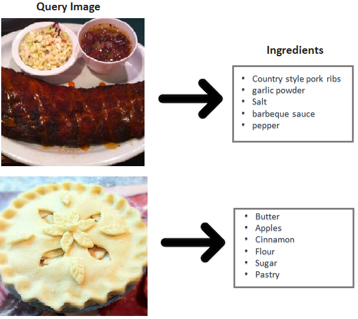
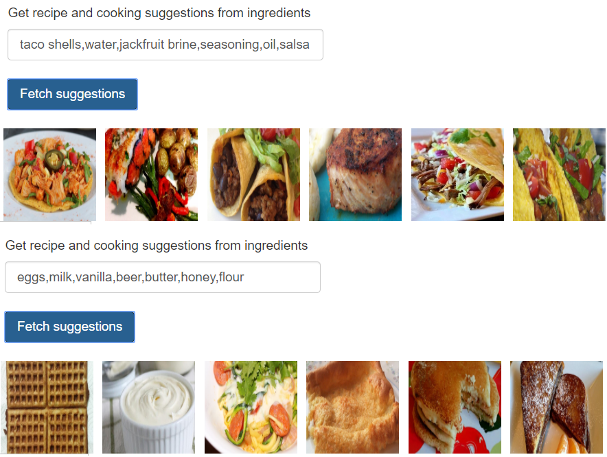

## NeuralCook

Deep learning application to identify ingredients from cooking dishes images and recommend dishes to cook, given a set of ingredients. This application leverages NLP and Computer Vision to learn semantic knowledge using joint embeddings.

Parsing an image of a dish and identifying its ingredients is not a complex task for humans. Indeed, people can quickly identify the dish and its ingredients just by looking at it. But it is much more complex for computers. To produce systems that can achieve this, we combine current state-of-the-art techniques in both Computer Vision and Natural Language Processing to learn the semantic knowledge from both images and recipes using joint embeddings.

# Dataset
The distinction between the difficulty of the chosen problem and previous supervised classification problems is that there are large overlaps in food dishes, as dishes of different categories may look very similar only in terms of image information. To address this complexity, we used the datasets from multiple sources - Food-101, allrecipes.com, and Recipe1M+ are the primary sources.

 

Our dataset consists of over 120,000 images and 5000 ingredient types. Food-101 dataset consists of images of food, organized by the type of food into 101 categories. It was used in the Paper "Food-101 - Mining Discriminative Components with Random Forests" by Lukas Bossard, Matthieu Guillaumin, and Luc Van Gool[2]. For the ingredients, we web scraped allrecipes.com using python scripts and regular expressions.

```
python web_scrapping/recipe_scrapper.py
```

This command scraps the data from allrecipes.com. You need to further download Food-101 data from https://www.kaggle.com/kmader/food41  

# Data Preprocessing
 

The ingredients data obtained from web scrapping consists of unstructured texts. For instance, ingredients are texts like "1 tablespoon of salt", "3/4 cup of rice". Here, tablespoon and cup represent the quantity and not ingredient. 

Also, few ingredient texts consisted of similar same ingredients with different names, like "bbq sauce" and "barbeque sauce", "smith apples" and "granny smith apples".To clean such data and to extract ingredient names from ingredients texts, we used NLP operations, text analysis, pre-processing, and keywords identification. 

To cluster the similar ingredients into one bucket, we used and open source software, OpenRefine, which clusters the words together based on various distance metrics and algorithms.

The images from food-101 and allrecipes.com are preprocessed, cleaned, and resized into 512 x 512.

# Run the model training

We train three deep learning models to learn the joint embeddings for the images and ingredients/recipe. Here we utilize the paired (recipe and image) data to learn a common embedding space.

 

```
python text_preprocessing.py
python intent_extraction.py
python Food_classification.py
python recipe_model.py
```
First, for the image representation we adopt state-of-the-art 16-layer VGGNet pre-trained on ImageNet as a base network and build a customized Convolutional Neural Network classifier on top of it to categorize the input dish image into one of the 101 categories.

We then remove the softmax classification layer from the model and use the output from the last fully connected layer to encode the images into 4096-dimension embeddings.

Secondly, before building the ingredient model, we clean and pre-process the ingredient text. For each ingredient we learn an ingredient level embedding representation. To do so, we train a customized Bidirectional LSTM (Bi-LSTM) to learn the features and the embedding space like that of the first model. The rationale for using a Bi-LSTM is that the ingredients list is an unordered set.

Finally, the ingredients embeddings and image embeddings are used to learn the Joint Embeddings. In simple terms, the goal is to learn transformations to make the embeddings for an image-ingredient pair close. To ensure this closeness, the model is trained with cosine similarity loss.

 

.png) 

# Web Application
We built web application and consumable REST APIs for users to integrate them into their applications, evaluate and capture feedback. The architecture for the application is depicted below.

.png) 

The image shows a 5-layered application with client, web server, application server, modeling, and database. The trained and saved models are run using python scripts and the web applications are built using Node JS.

The functionalities of the application include, classification of an image, predicting the ingredients in the dish's image, fetching similar-looking images, and recommending the dishes given a set of ingredients. The client interacts with the web server by making HTTP get or put requests.

```
python api.py
npm run server
npm run start
```


# Results
We evaluated the application with 10,000 images from various categories. The food image classification, ingredient embedding, and recommendation retrieval systems are evaluated separately and as a whole for a better understanding of the model performance. We also built REST API for each of the three models so that the application will be open source and consumable to other users.
# Image classification
The input image is first passed through the CNN network for classification. The classification model when run on 10,000 images, achieved 85% accuracy.

 

# Ingredient retrieval from image

 

As you can see from the image, the second dish I uploaded was chicken fried rice, which we cooked at home. Since the model was not trained on chicken fried rice category, it assigned the dish to the closest one, which is, fried rice. This is a universal problem. There is no way any model can categorize every dish that is present.

This is where the joint embedding and language model we built helps us identify the ingredients and recipe. We see that the Bi-LSTM identifies chicken breasts as one of the ingredients, which is what was missing from the image analysis.

# Similar images retrieval
The similar images retrieval model is evaluated based on the top 10 and top 5 recommendations. The top-10 model achieved an accuracy of 95% and top-5 achieved 91%.

This similarity model is used to prune the results further, the application goes a step further to provide similar images to the user from the 120,000 images database.

 

# Dish recommendation from ingredients inventory

 

# Conclusion
Considering the increase in the amount and the popularity of food images in social media which might interest the users to try out different dishes they see. Seldom people know the ingredients they need to prepare the dish, or they might not know the name of the dish they see. We address this in this paper, by presenting The Neural Cook module to identify dishes, extract ingredients, and suggest similar looking dishes. Further the model also recommends dishes given a set of ingredients. We present this idea in the form of an interactive web application that is open-sourced and makes it easier for the users to get the ingredients and names of their favorite foods. We plan on extending this model further to fetch recipes from a given image and fetch images given a recipe as well as to extend the scope of the number of categories.
